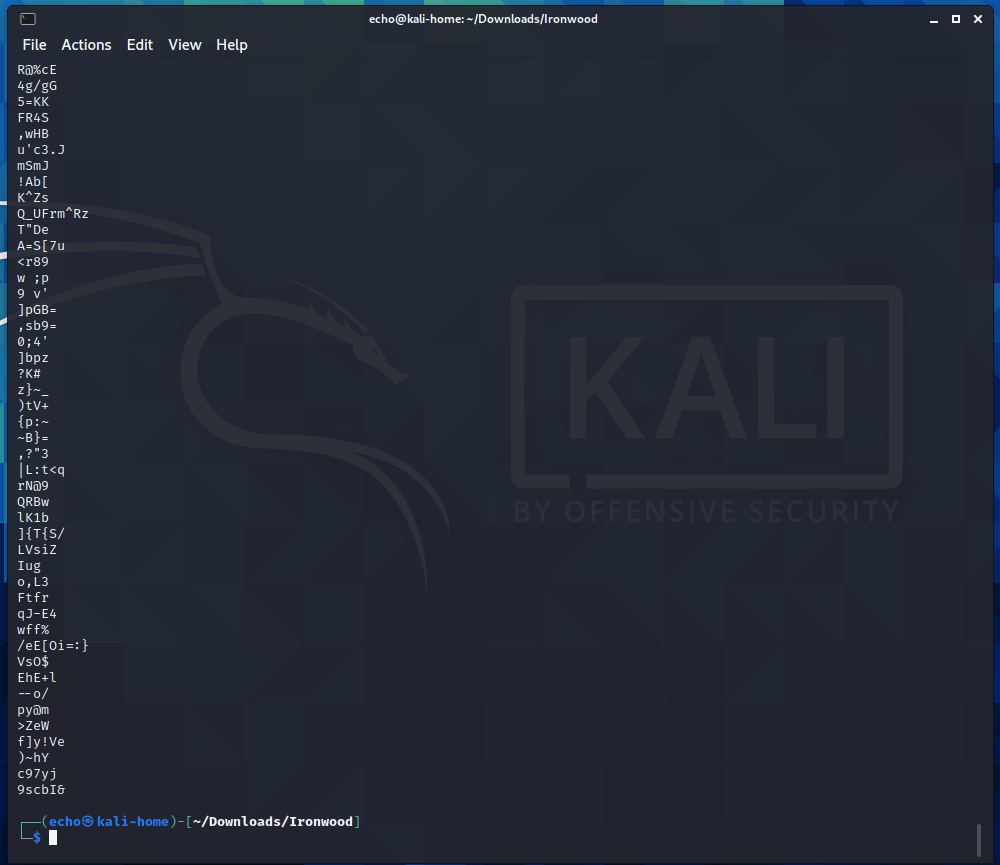
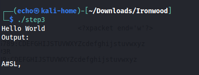

Ironwood Cyber did a CTF on July 20th 2023 to get one of their delightful badges.  The CTF consisted of 4 steps/challenges across various areas.  Overall it was a fun CTF with a GREAT pivot after some of the infrastructure went down.

### Challenge 1: Stenography

After popping into IWC's Discord, they provided an image in their events channel and it was off to the races!  With running $`strings` on the provided file, it came back with a bunch of gibberish



I opted to throw all of the text into a file using $`strings IWC.jpg > IWC.txt` to see if that made it more readable, which it did!


The output showed some HTML, so I opted to change the filetype from .txt to .html and see what that resulted in. Luckily it came out with a bunch of gibberish and some URLs at the top, one of which turned out to be a Rickroll :) and the other led to a hint on what to use for a password with the image.

From here I was a tad lost, so I googled around a bit for stenography sites to use and stumbled upon [futureboy](https://futureboy.us/stegano/decinput/html) which was useful for me because it relies on the tool that was intended to be used for this (steghide BTW).  Since the site accepts an image file and a password, I submitted both, using "guest" from the hint before and was rewarded with a nice hint/text that read:

```
Congrats! Give us a call at(XXX)XXX-9200

```

Challenge 1 Summary:

- Input: Image provided by IWC
- Output: Directions on where to find the next flag
- Suggested Path: Image -> `strings` -> steghide -> next flag
- My Path: Image -> strings -> file conversion/manipulation -> lucky Google/site that used steghide -> next flag

Challenge 1 Lessons Learned:

- `strings` is a nice swiss army knife command
- If you're overwhelmed by the `strings` output, throw it into a file and see what pops out
- Have the regular tools at the ready for a given challenge so you don't have to Google around and get an unexpected lucky break (In mycase I didn't even know about steghide before this)

---

### Challenge 2: Morse Code

After calling the phone number provided you're given a recording that is about 20 seconds long and consists of a series of beeps (dots and dashes).  This challenge was not the most fun for me since I have audio processing issues.  For this one, I recorded the audio and put it into a visualizer to get the following image:


From here I was able to recognize the audio that I heard and what I could see as dots and dashes, so I wrote down each dash and dot and put it into a Morse code translator at [Morse Code Translator](https://capitalizemytitle.com/morse-code-translator/) One that would have been more useful would have been [Morse Code World](https://morsecode.world/international/translator) because I would have been able to find that I could upload the audio recording I had, but that wasn't my first Google result so I went with what I had.

The result from above led to a nice tinyURL that led to the next challenge.

Challenge 2 Summary:

- Input: Audio/audio recording
- Output: tinyURL with the next challenge
- Suggested Path: Audio -> decoding -> next flag
- My Path: Audio -> recording -> visual decoding  -> next flag

Challenge 2 Lessons Learned:

- Know Morse code? (or at least useful resources for it)

---

### The Pivot

Huge shoutout to IWC for the pivot, because the next flag was a link to a pastebin that contained some Python code.  Upon trying to run that code, the output was that the server was actively refusing the connection.  At this point I still thought it was part of the challenge and went down a rabbit hole trying to nmap the server (ended up finding SSH and Pharos running) and was trying to see if there was a way to exploit the Pharos service when I noticed that according to Discord step 3 was apparently down/the server instances wouldn't stay up.  All the participants ended up in a holding pattern for about 15 minutes while IWC admins pivoted and made the challenge available as a binary.

Lessons learned:
- Be kind to your CTF admins

--- 

### Challenge 3: Crypto/Input Validation

After getting the updated set of steps and the binary from the CTF, I started down the path of running it and working on it with good old `chmod +x` and got a nice prompt looking for input 




After trying a number of different strings, I threw in a bunch of spaces and got the following out:


This part frustrated me for a couple of hours at least because I kept trying different versions of the XKDKFKGNGSQR string thinking maybe it was ROT-13 or something similar.  I even went so far as to open it up in Ghidra and figure out what was happening under the hood (I saw some XORs and bit shifts happening so I was confused enough to ask ChatGPT for help lol). In reality I was close, but instead of just spaces, null characters gets out the right string.  

ChatGPT fail


The Correct result


Challenge 3 Summary:

- Input: Binary provided by IWC
- Output: Directions on where to find the next flag
- Suggested Path: Binary -> input -> flag
- My Path: Binary -> Lots of random input attempts -> getting stuck on one particular piece -> flag

Challenge 3 Lessons Learned:

- If you're spending too long on something (~45 minutes) it's probably a rabbit hole
- Test out a wide variety of characters/inputs (possibly automate it if you can)
- Have the regular tools at the ready for a given challenge so you don't have to Google around the rabbit holes
- Try potential alternate paths, but watch out for the aforementioned rabbit holes

---

### Challenge 4: Reverse Engineering

After getting the URL for challenge 4, we were presented with *another* binary.  After downloading this one and doing `chmod +x` you find that it opens a prompt asking for a number between 1 and 100.  The short answer is that any of the answers will give you links that lead to memes or rickrolls.

Opening it up in Ghidra and analyzing it pops you into main, which jumps to function g(), taking a look at function g() results in the following:


So this is obviously the driver/main for the program and it branches off into the various functions based off of that.  The curious thing is that even though it's alphabetical, there's no d() here.  From here is where I made my mistake(s)

1.  I actually don't have Ghidra in my VM because I thought it would be a pain in the ass so I had a *whole* convoluted process to get the binary over to my Windows machine so I could open it and analyze it in Ghidra, and then do the reverse when I thought I had it figured out.
2. In this case to get to function d() I would have used `JMP` as opposed to the correct `CALL` in the stack, because I thought an unconditional jump would work, however upon getting a seg-fault upon trying to run the binary I learned that `JMP` only works for process/functions in main, and `CALL` will work with functions outside of main [https://www.tutorialspoint.com/difference-between-call-and-jump-instructions](source)

Challenge 4 Summary:

- Input: Binary provided by IWC
- Output: Completing the CTF!
- Suggested Path: Binary -> input -> RE -> flag
- My Path: Binary -> Lots of random input attempts -> going back/forth to seg-faults 

Challenge 4 Lessons Learned:

- Have the tools you need loaded up in the VM
- Get a better understanding of `gdb` and/or Ghidra/IDA/BinaryNinja
- Have a more complete understanding of assembly, the stack, stack pointers, etc...

----
---
---

### Conclusion

Overall great job by the IWC team for a great CTF and a fun time.  I learned a lot about what to do (and not do) for CTF stuffs.  Hoping that they run another one next year. 

